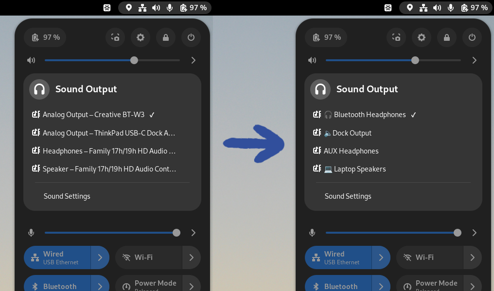

#  Quick Settings Audio Devices Renamer (Gnome Extension)

<a href="https://extensions.gnome.org/extension/6000/quick-settings-audio-devices-renamer/">

</a>

This is a Gnome Shell Extension that lets you change the names of your audio
devices in the Quick Settings Audio Panel. This works for both speakers and
microphones. It's useful when you need to switch quickly between different audio
devices and their default names aren't very clear or they're a bit too explicit.

For example, instead of having "Speaker - Family 17h/19h HD Audio Controller" in
the panel, you could simply have it as "Laptop Speakers", or whatever else you'd
want to see there.



> [!TIP]
> Also try the [Quick Settings Audio Devices Hider](https://github.com/marcinjahn/gnome-quicksettings-audio-devices-hider-extension) extension!

## Configuration

The devices names may be configured via preferences window.

### Output Devices


### Input Devices


## Contributing

In case of problems, it's a good idea to open an
[Issue](https://github.com/marcinjahn/gnome-quicksettings-audio-devices-renamer-extension/issues).
If you know how to fix it, open a [Pull
Request](https://github.com/marcinjahn/gnome-quicksettings-audio-devices-renamer-extension/pulls)!

### Local Development

To run the extension locally "from sources":

```
git clone git@github.com:marcinjahn/gnome-quicksettings-audio-devices-renamer-extension.git
cd gnome-quicksettings-audio-devices-renamer-extension
npm i
npm run build
npm run linkdist
```

The last command will creae a soft link at
`~/.local/share/gnome-shell/extensions/quicksettings-audio-devices-renamer@marcinjahn.com`,
which allows you to enable the extension on your system (e.g., via [Extensions
Manager](https://flathub.org/apps/com.mattjakeman.ExtensionManager)).

Anytime you change anything, rebuild the extension with `npm run build`, and
restart the session:

- on Wayland, log out and log in (I know, it's painful),
- on X11, open "Run a Command" dialog (Alt + F2), type "r" and press Enter

## Remarks

- note that the extension does not rename the devices "deep" in the system. It
  only renames their labels in the Gnome Shell Quick Setting Audio Panel. If
  anything looks fishy to you, all you got to do is disable the extension, and
  re-login to your system. All names will be restored to their original form.
- if, in addition to renaming your devices, you'd also like to remove some of
  them from Quick Settings, try out my [Quick Settings Audio Devices
  Hider](https://github.com/marcinjahn/gnome-quicksettings-audio-devices-hider-extension)
  extension. "Renamer" is compatible with "Hider" v9 and up.
- this extension is compatible with the "Show current output/input selection"
  option of the [Quick Settings Tweaker
  extension](https://extensions.gnome.org/extension/5446/quick-settings-tweaker/).
  Even if you've installed Quick Setting Tweaker and have this option enabled,
  outputs/inputs should be correctly displaying in the Quick Settings panel.

## Mentions

- [OMG!
  Ubuntu](https://www.omgubuntu.co.uk/2023/06/rename-audio-devices-gnomes-quick-settings)
